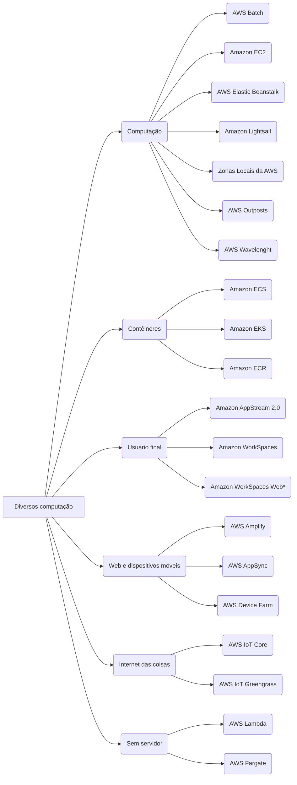

# Índice - Conteúdo - AWS Cloud Practitioner - CFL-C02

Em construção

## Serviços - versão extendida:

### Diversos - computação:
  

      
<b>Computação</b>

        <ol>
          <li><a href="https://github.com/millena84/aws-cfl-c02-pt-br/blob/main/diversos-computacao/computacao/AWS-Batch.md">Amazon Batch</a></li>
          <li><a href="https://github.com/millena84/aws-cfl-c02-pt-br/blob/main/diversos-computacao/computacao/Amazon-EC2.md">Amazon EC2*</a></li>
          <li><a href="https://github.com/millena84/aws-cfl-c02-pt-br/blob/main/diversos-computacao/computacao/AWS-Elasic-Beanstalk.md">AWS Elastic Beanstalk</a></li>
          <li><a href="https://github.com/millena84/aws-cfl-c02-pt-br/blob/main/diversos-computacao/computacao/Amazon-Lightsail.md">Amazon Lightsail</a></li>
          <li><a href="https://github.com/millena84/aws-cfl-c02-pt-br/blob/main/diversos-computacao/computacao/AWS-Local-Zones.md">Zonas Locais da AWS*</a></li>
          <li>AWs Outposts</li>
          <li>AWs Wavelenght</li>
        </ol>
  

  

      
<b>Sem servidor</b>

        <ol>
          <li><a href="https://github.com/millena84/aws-cfl-c02-pt-br/blob/main/diversos-computacao/sem-servidor/AWS-lambda.md">AWS Lambda*</a></li>
          <li>AWs Fargate</li>
        </ol>
  

  

      
<b>Contêineres</b>

        <ol>
          <li>AWS ECS</li>
          <li>AWS EKS</li>
          <li>AWS ECR</li>
        </ol>
  

    

      
<b>Computação de usuário final</b>

        <ol>
          <li>Amazon AppStream 2.0</li>
          <li>Amazon Workspaces</li>
          <li>Amazon Workspaces Web</li>
        </ol>
  

  

      
<b>Web e dispositivos móveis</b>

        <ol>
          <li>AWs Device Farm</li>
          <li>AWs Amplify</li>
          <li>AWS App Sync</li>
        </ol>
  

  

      
<b>Internet das coisas</b>

        <ol>
          <li>IoT Core</li>
          <li>IoT greengrass</li>
        </ol>
  

  
--- 

# Visão do conteúdo - Mapa mental:
Contém somente os nomes dos serviços

Diversos computação:

  

---

# Conteúdo extra
- [Mapa mental - CFL-C02](https://www.mindmeister.com/app/map/3008228986?t=NOu7B2okNO)
## Diversos - Computação
### Computação
- [ECS, Docker, EKS e Kubernetes "em um tweet" e com analogia](https://github.com/millena84/aws-cfl-c02-pt-br/blob/main/extras/ecs-docker-eks-k8s-em-1-tweet.md)
